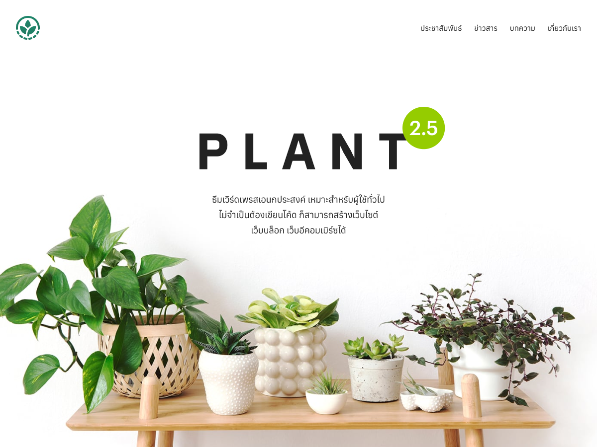

# Plant Theme (Maintained Fork)  [ภาษาไทย](https://github.com/Anasxrt/plant-2.5-fork/blob/master/README-TH.md)

## Production Status ✅

## Latest Update (May 2026)

This release includes PHP 8.3+ and WordPress 6.9+ compatibility improvements:

- Added official php-stubs for better static analysis
- Added PHP 8.3 type hints and PHPDoc annotations
- Verified no deprecated functions are used
- Maintained full backward compatibility

**This version is production-ready and has passed code review (March 2026).**

| Check | Status |
|-------|--------|
| PHP Code Review | ✅ Passed |
| JavaScript Review | ✅ Passed |
| CSS/SCSS Review | ✅ Passed |
| Debug Code Check | ✅ No console.log/die() found |
| Build Config | ✅ Production optimized (webpack drop_console, minified CSS/JS) |
| Dependencies | ✅ All bundled |

---

## About This Fork

This is a **maintained fork** of the Plant 2.5 WordPress theme, originally developed by [Seed Webs](https://seedwebs.com). This fork was created specifically for website owners who want to keep their existing Plant 2.5 design without migrating to Plant 3.

### Why This Fork?

Many website owners have invested significant time and effort into customizing their Plant 2.5 theme. With the release of Plant 3, these users faced a difficult choice:

- **Migrate to Plant 3** and undergo a full site redesign
- **Stay on Plant 2.5** and miss out on security updates and PHP compatibility

This fork solves that problem by providing:

- **PHP 8.3+ Compatibility** - Modern PHP support for current server environments
- **Security Updates** - XSS protection and other security hardening
- **Stability Fixes** - Bug fixes and performance improvements
- **Gutenberg Editor Support** - Preserves the familiar Gutenberg editing experience

### What This Fork Provides

✅ **Security Updates** - Critical security patches to protect your site
✅ **PHP 8.3+ Support** - Compatible with modern PHP versions
✅ **Bug Fixes** - Stability improvements and error corrections
✅ **Performance Optimization** - Caching and efficiency improvements

### What This Fork Does NOT Provide

❌ **New Features** - This fork focuses on maintenance, not new functionality
❌ **Major Design Changes** - Preserves the original Plant 2.5 design

### For New Features

If you want access to new features and functionality, please consider:

- **Upgrading to Plant 3** when ready for a full redesign
- **Waiting for future feature releases** of this fork

### Attribution

This theme is based on the original [Plant theme by Seed Webs](https://seedwebs.com/package/plant/). We thank the Seed Webs team for creating such a versatile and popular theme.

---

## Vendor Dependencies & Updates

This theme bundles several third-party libraries. Here's what you need to know about updating them:

### Bundled Vendors

| Vendor | Current Version | Purpose | Update Method |
|--------|-----------------|---------|---------------|
| ACF (Advanced Custom Fields) | 6.2.0 | Custom fields and field groups | Manual replacement |
| Kirki Customizer Framework | 5.2.2 | Theme customizer | Manual replacement |
| Smart Slider 3 Pro | 3.5.1.34 | Slider functionality | Manual replacement |
| One Click Demo Import | 3.4.0 | Demo content import | Manual replacement |
| TGM Plugin Activation | Latest | Required plugins management | Manual replacement |

### How to Update Vendors

1. **Download the latest version** from the vendor's official website
2. **Backup your site** before making changes
3. **Replace the vendor folder** in `vendor/` directory
4. **Test thoroughly** to ensure compatibility

### Important Notes

- **ACF:** The bundled version is 6.2.0 (released August 2023). ACF has released newer versions with additional features and security fixes. Update at your own risk - newer versions may require PHP 7.4+ which is compatible with our PHP 8.3 requirement.

- **Kirki:** Version 5.2.2 is bundled. Check for newer versions at https://kirki.org/

- **Smart Slider 3 Pro:** Requires a valid license for updates. Contact Seed Webs for license renewals.

- **One Click Demo Import:** Optional plugin. Can be removed if not needed.

### External Plugin Recommendations

While this theme bundles these vendors, for better maintenance we recommend:

- Install ACF from WordPress.org repository for automatic updates
- Install Kirki from WordPress.org repository  
- Use the externally hosted versions instead of bundled ones when possible

---

## Original Theme Information

**Original Theme:** Plant by SeedWebs.com  
**Original Version:** 2.5.9  
**License:** GNU General Public License v2 or later

---

## Change Log

### 2.5.9.1-1

- Date: 24 MAR 2026
- **Fix: KeenSlider v6.8.6 API Change** - Updated from v5.2.0 to v6.8.6
- **Fix: Slider JS Error** - Changed `instance.details()` to `instance.track.details` API
- **Fix: Null Safety** - Added checks to prevent slider initialization errors
- **Fix: Missing JS Helpers** - Added missing functions (addClass, removeClass, domReady, getClosest)
- **Fix: Script Dependencies** - Fixed proper load order for scripts
- **Fix: Conditional Dependencies** - Fixed s-vanilla script dependency when KeenSlider is disabled
- **Fix: Expose** - domReady, addClass, removeClass globally in main-vanilla.js
- **Fix: Correct --s-footer-height** - from 300px to 40px (matching original design)
- **Build: Regenerated** - all minified CSS and JS files
- **Update: KeenSlider Version** - From 5.2.0 to 6.8.6

### 2.5.9.1

- Date: 23 MAR 2026
- **New: PHP 8.3+ Compatibility** - Updated to support PHP 8.3 and above
- **New: Security Enhancements** - Added XSS protection using wp_kses_post(), esc_html(), esc_attr(), and esc_url()
- **New: Tabnabbing Protection** - Added rel="noopener" to external links
- **Fix: WooCommerce Deprecated Function** - Replaced woocommerce_get_page_id() with wc_get_page_id()
- **Performance: Cached WooCommerce page ID** - Reduced redundant function calls
- **Update: Smart Slider 3 Pro** - Updated to version 3.5.1.34
- **Update: Theme Version** - Updated to 2.5.9.1
- **Update: Author Attribution** - Added Montri Udomariyah as fork maintainer
- **Update: WordPress Compatibility** - Tested up to WordPress 6.9.4, requires 6.0+

---

## Original Change Log (Seed Webs)

### 2.5.9

- Date: 4 SEP 2023
- New: Smart Slider 3 Pro 3.5.1.19
- New: ACF 6.2.0

### 2.5.8

- Date: 9 AUG 2023
- New: ACF 6.1.8
- New: Smart Slider 3 Pro 3.5.1.18
- New: Kirki 5.0.0

### 2.5.7

- Date: 8 MAY 2023
- New: ACF 6.1.6
- Fix: Sales Page js error if no "Free" text defined.
- Fix: footer-height in woocommerce checkout page

### 2.5.6

- Date: 12 APR 2023
- New: Smart Slider 3 Pro 3.5.1.14
- New: ACF 6.1.3
- Tweak: Use span/em for better SEO
- Tweak: Shortcode Offset
- Fix: WooCommerce variable percentage
- Fix: WooCommerce Pagination

### 2.5.5

- Date: 22 AUG 2022
- New: Smart Slider 3 Pro 3.5.1.9
- New: ACF 5.12.3
- Tweak: WooCommerce Variation CSS
- Tweak: PHP Notice on seed_posts_navigation()

### 2.5.4

- Date: 15 AUG 2022
- New: Smart Slider 3 Pro 3.5.1.8
- New: One Click Demo Import 3.1.2

### 2.5.3

- Date: 7 JUL 2022
- Tweak: WooCommerce Review. Enable in Customizer -> WooCommerce -> More Settings.
- Fix: Duplicated Files in Page Tempaltes folder.

### 2.5.2

- Date: 2 JUN 2022
- Tweak: Hide banner after click with js, not css.
- Fix: Swap FB Pixel and GA ID field.

### 2.5.1

- Date: 2 JUN 2022
- Fix: Customizer not loaded.

### 2.5.0

- Date: 2 JUN 2022
- New: Cookie Consent for PDPDA in Customizer.
- New: ACF Pro 5.12.2
- New: Smart Slider 3 Pro 3.5.1.7
- New: Kirki 4.0.24

### 2.4.3

- Date: 4 APR 2022
- New: ACF Pro 5.12.1
- New: Smart Slider 3 Pro 3.5.1.4.
- New: Kirki 4.0.23
- New: One Click Demo Import 3.1.1.
- Tweak: Sales page: Require product selected before submit form.
- Tweak: Sales page: Auto account no. width.
- Tweak: Add more left action options for Right Logo Header on mobile.

### 2.4.2

- Date: 31 DEC 2021
- New: ACF Pro 5.11.4
- New: Smart Slider 3 Pro 3.5.1.2.
- New: Kirki 4.0.3
- New: Post & Product Blocks now support Random Posts / Products.
- Tweak: Adjust Code for Kirki 4 & WooCommerce.
- Tweak: Block Category now support WordPress 5.8.
- Tweak: Some CSS for WooCommerce.
- Tweak: Chat Buttons overlay WooCommerce button.
- Fix: WooCommerce Sales Badge with infinite decimal.

### 2.4.1

- Date: 13 OCT 2021
- Fix: Error on archive page if no WooCommerce activated.

### 2.4.0

- Date: 11 OCT 2021
- New: Full Support for WooCommerce.
- New: Support Premmerce Product Filter and Predictive Search for WooCommerce.
- New: RANKA - WooCommerce Demo Site.
- New: Smart Slider 3 Pro 3.5.1.0.
- Tweak: PLANT demo v2.
- Fix: Show admin bar only in wp-admin.
- Fix: Customizer Color Setting in header.

### 2.3.10

- Date: 22 SEP 2021
- New: Smart Slider 3 Pro 3.5.0.11.
- New: Add Category to content-caption.
- New: Support Seed Stat Pro (auto add_action for archive and single page).
- New: Actions: plant_begin_archive_meta and plant_end_archive_meta on,
  - content-card
  - content-list
  - content-caption
- Tweak: Support WPMU for My Account Icon.

### 2.3.9.1

- Date: 11 SEP 2021
- Fix: Add Footer Blocks Setting in Customizer. To hide sample widgets on newly created sites.

### 2.3.9

- Date: 8 SEP 2021
- New: ACF Pro 5.10.2
- New: Action:
  - plant_begin_nav_m
  - plant_end_nav_m
  - plant_begin_entry_meta
  - plant_end_entry_meta
  - plant_begin_entry_content
  - plant_before_entry_tags
  - plant_before_entry_author
  - plant_end_entry_content
- New: Filter: plant_breadcrumb
- New: Widget Area: mobile_nav
- New: Blocks: Post Grid / Post Slider support order by oldest.
- New: Sales Page: Support 2 decimals pricing.
- Tweak: [s_icon] support width and height.
- Fix: Sales Page: Buy now button disappeared, Long text breaks layout, Hide summary causes errors.
- Fix: Seed Web Blocks Group.
- Fix: Attachment named footer became site footer.
- Fix: WooCommerce CSS / Fonts / Add to cart animation.

### 2.3.8

- Date: 6 AUG 2021
- New: Smart Slider 3 Pro 3.5.0.10
- New: ACF Pro 5.9.9
- New: Kirki 3.1.9
- New: Footer Blocks Widget. Better than page named footer.
- New: Sales Page - Select only one Product.
- New: Sales Page - Hide product amount.
- New: Sales Page - Limit Purchase from Stock.
- New: Sales Page - Show / Hide Stock.
- New: Sales Page - Add COD Cost.
- New: Sales Page - Add Buy Now Button.
- Tweak: WooCommerce Sales Price CSS
- Fix: Sales Page incorrectly display Desktop Columns.
- Fix: Translation for Bank information in Sales Page.
- Fix: Footer Code in Landing Page / Sales Page / Soon Page Templates.
- Fix: Footer Columns Setting bug in Customizer.

### 2.3.7

- Date: 4 JUL 2021
- New: Send Line Notify using forminator hook.
- New: Smart Slider 3 Pro 3.5.0.9
- New: ACF Pro 5.9.7
- New: Kirki 3.1.8
- Tweak: Move Forminator Upload files to /wp-content/uploads/forminator/
- Tweak: Accessibility Button text.
- Tweak: Rebrand SeedThemes to Seed Webs.
- Tweak: Add info in plugin page for Smart Slider Update.
- Fix: Sales Page sent blank info if no product selected.
- Fix: Dropdown menu icon size.
- Fix: PHP Notice for TGMPA.
- Fix: PHP Notice for Kirki.

### 2.3.6

- Date: 6 JUN 2021
- New: Line Notify for Sales page
- New: Smart Slider 3 Pro 3.5.0.8

### 2.3.5

- Date: 23 MAY 2021
- New: Smart Slider 3 Pro 3.5.0.7
- New: Actions: plant_begin_site_action and plant_end_site_action.
- Tweak: Customizer - Header Mobile Color Setting.
- Tweak: WooCommerce CSS.
- Fix: WooCommerce Default Cart Icon not shown.
- Fix: Forminator CSS.

### 2.3.4

- Date: 13 MAY 2021
- New: Hide Plant Theme Setting. (If using Child Theme.)
- New: Smart Slider 3.5.0.6
- New: Move from SeedThemes.com to SeedWebs.com

### 2.3.3

- Date: 2 MAY 2021
- New: Smart Slider 3.5! with Page Speed 100 on Mobile and Desktop.
- New: Product Grid Block.
- New: Product Slider Block.
- New: Header Customizer - Max Container Width.
- New: Header Customizer - Logo for Mobile (Separated Image).
- New: Header Customizer - Hide Site Title for mobile.
- Tweak: Post Block now can use Post & Page for Custom Select.
- Fix: Hide Footer Column by default.

### 2.3.2

- Date: 27 APR 2021
- New: Add Scroll Effect. Animated on scroll. (Enable in Customizer → Other).
- New: One Click Demo Import
- New: Demo for Plant & Salepage. https://plant.seeddemo.com/
- New: Demo for Ongkorn. https://ongkorn.seeddemo.com/
- Tweak: Enable Footer Column by defaut and add some helper text.
- Tweak: Keen Slider 5.4.0
- Tweak: Change default container & gutter space (1110px and 30px).

### 2.3.1

- Date: 19 APR 2021
- Fix: ACF Salepage error.

### 2.3.0

- Date: 19 APR 2021
- New: Sale Page Feature.
- Tweak: Support Chat Buttons on Landing Page & Sale Page.
- Tweak: Support Rank Math.
- Tweak: Remove H1 for Hidden Title.

### 2.2.2

- Date: 1 MAR 2021
- Tweak: Show theme license menu only on parent theme.
- Fix: Related Posts include current post.

### 2.2.1

- Date: 28 FEB 2021
- New: Related Posts. Enable in Customizer.
- New: Soon - Page Template.
- New: Sub Menu Width Setting in Customizer.
- New: ACF Pro version 5.9.5.
- Tweak: Responsive Font Size for H1-H6.
- Tweak: Add date on Content Hero Template.
- Tweak: Show Content Hero for Blog Page.
- Fix: Auto Height Footer

### 2.2.0

- Date: 25 JAN 2021
- New: Chat Buttons.
- New: Support GenerateBlocks as Footer (Create Page with slug /footer/).
- New: Rewrite Customizer. Easier for Header settings.
- New: Smart Slider 3 Pro version 3.4.1.16.
- New: ACF Pro version 5.9.4. - Support PHP 8.0
- Fix: WooCommerce with Thai Address.

### 2.1.4

- Date: 25 DEC 2020
- New: Customizer: Logo align left / right.
- New: Customizer: WooCommerce Style settings.
- New: Customizer: header / footer scripts.
- New: Auto add arrow down for desktop menu.
- New: content-date.php
- New: Smart Slider 3 Pro version 3.4.1.14.
- New: Kirki version 3.1.6.
- New: ACF Pro version 5.9.3.
- Tweak: Show Custom Fonts only in Gutenburg Editor.
- Tweak: My account link to page instead lightbox.
- Tweak: functions.php: use theme version for css/js version.

### 2.1.3

- Date: 26 NOV 2020
- New: Smart Slider 3 Pro version 3.4.1.13.
- New: Shortcode [s_icon].
- Tweak: content-single.php.
- Fix: Footer height not correct.

### 2.1.2

- Date: 9 SEP 2020
- Tweak: CSS Style for WooCommerce.

### 2.1.1

- Date: 6 SEP 2020
- New: Mobile menu icon with text.
- New: Footer Columns settings.
- New: Footer Bar settings.
- New: Option: Hide Title on all Pages.
- New: Support GenerateBlocks.

### 2.1.0

- Date: 31 AUG 2020
- New: Merge code from Seed 2.1.
- New: Using Keen Slider, replace Flickity.
- New: Using Anuphan font for default heading font.
- New: SVG Icons and [s-icon i="ICON_NAME"] shortcode.
- New: Footer Widget as Columns in Customizer.
- New: Smart Slider 3 Pro version 3.4.1.9.
- New: Kirki version 3.1.5.
- New: ACF Pro version 5.9.0.
- Tweak: Drop IE support.

### 2.0.7

- Date: 8 JUL 2020
- New: Censored license on Theme License Page.
- New: Smart Slider 3 Pro version 3.4.1.8.
- New: Kirki version 3.1.3.
- New: ACF Pro version 5.8.12.
- Tweak: Check license from seedthemes.com instead of th.seedthemes.com

### 2.0.6

- Date: 17 MAY 2020
- New: Default (Global) Title Style.
- New: Smart Slider 3 Pro version 3.4.1.5.
- New: Kirki version 3.1.2.
- New: ACF Pro version 5.8.11.
- FIX: Error if front page using Right bar / Left bar template.
- Tweak: No longer supports Internet Explorer browser at all!

### 2.0.5

- Date: 6 APR 2020
- New: Smart Slider 3 Pro version 3.3.28.
- New: Kirki 3.1.1.
- New: ACF Pro 5.8.9
- New: Font Awesome 5.13.0
- Fix: Font Awesome Loading

### 2.0.4

- Date: 10 DEC 2019
- New: ACF Pro 5.8.7
- Fix: Redirect after login cause blank wp-login.php
- Tweak: Support Calling ACF from child theme

### 2.0.3

- Date: 10 DEC 2019
- Fix: JS Error on wp-admin.
- New: Smart Slider 3 Pro version 3.3.24.

### 2.0.2

- Date: 11 NOV 2019
- Fix: Move Maledpan font folder. Now support Seed Font plugin.

### 2.0.1

- Date: 3 NOV 2019
- Tweak: Disable tabs on WooCommerce.
- Fix: Button settings conflicted with Kadence Theme & WooCommerce.
- Fix: Backend display not correctly.

### 2.0.0

- Date: 31 AUG 2019
- Rebuilt from Seed2
